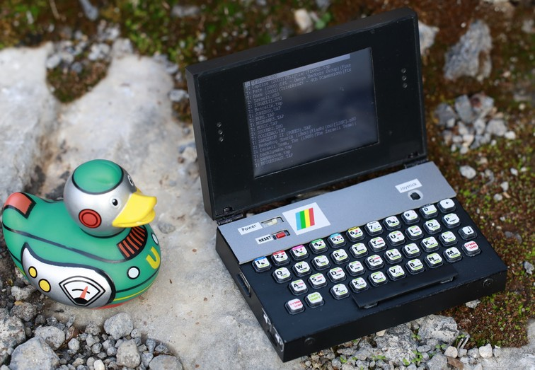
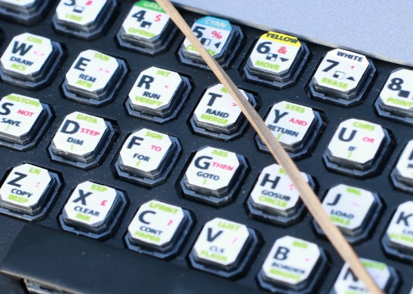

# ZX Spectrum 128k micro laptop.  
  
  
  
First of all thanks to mr. Samsonov Dima (https://github.com/sdima1357/spectrum128_cpm_8bit).  
This project wouldn't never come true without his code and support.  
  
Also thanks to https://github.com/w4ilun/pocket-keyboard and all [TMK Keyboard](https://github.com/tmk/tmk_keyboard)   community :)  
Their amazing software are really customizable even for zx spectrum. Much neat.  
  
Thanks to [ZX UNO](https://zxuno.speccy.org/descarga_e.shtml) for keyboard prints.  
  
  
Important notes for "VCC-GND STM32F407VET6 Mini" Board:  
-Those boards uses PA8 for sd-card sensing. Disconnect it.  
-Change crystal from 25mHz to 8mHz.  
-Remove all fat parts: boot select switch, usb port, reset button.   
  
Keyboard [pocket_kbd_lufa_ZX.hex](keyboard/pocket_kbd_lufa_ZX.hex) is for arduino pro micro.  
Emulator [spectrum128_cpm_8bit-main.hex](spectrum128_cpm_8bit-main.hex) goes to STM32f407vet6.  
  
  
  
**Keyboard part:**  

  
  
   
**Arduino Pro Micro (ATmega32u4) pins:**  

  
  
**Keyboard palmrest pattern:** 	 Print and cut.  

  
  
  
**Main part:**  
  
  
**ILI9341 8-bit parallel FSMC interface:**  
  
LCD_D0 - PD14	//FSMC_D0  
LCD_D1 - PD15 	//FSMC_D1  
LCD_D2 - PD0  	//FSMC_D2  
LCD_D3 - PD1 	//FSMC_D3  
LCD_D4 - PE7 	//FSMC_D4  
LCD_D5 - PE8 	//FSMC_D5  
LCD_D6 - PE9 	//FSMC_D6  
LCD_D7 - PE10	//FSMC_D7  
  
LCD_RS - PD13  
LCD_RD - PD4  
LCD_WR - PD5  
LCD_CS - PD7  
LCD_RST - PD8  
  
SND_LEFT - PA8  to the stereo AMP.  
SND_RIGHT - PA9  to the stereo AMP.  
  
  
UART_TX - PA2 -> 115200 8n1 debug output.  
UART_RX - PA3 <-  
  
USB_DM - PA11 //Arduino KB USB.  
USB_DP - PA12 //Arduino KB.  
  
  
  
  
Complete size is 90x60x22mm.  
Battery lasts for about 2 hours.  
  
  
  
  
  
  